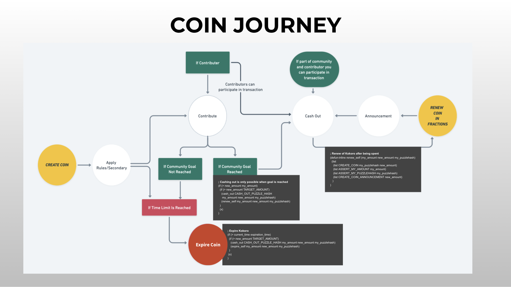
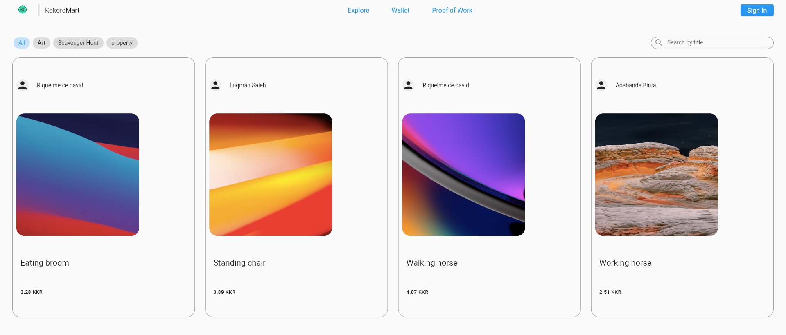
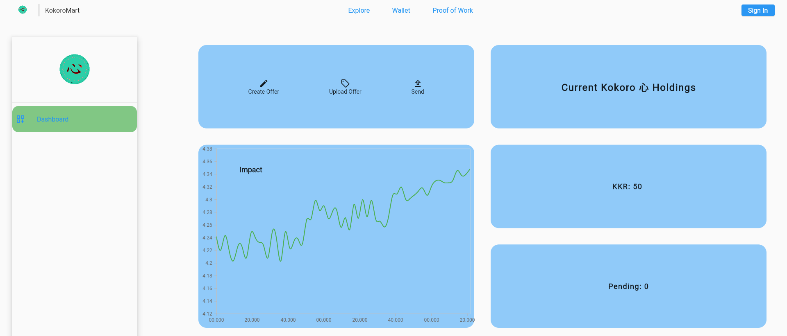
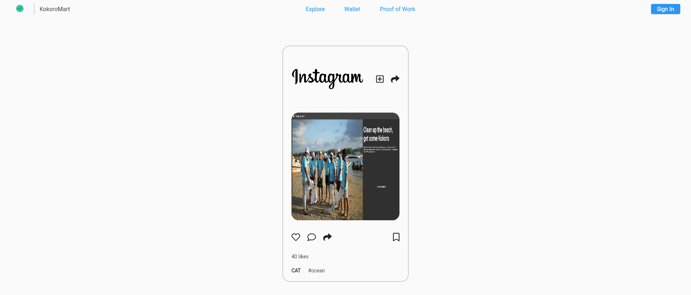

[![MIT License][license-shield]][license-url]
[](https://devpost.com/software/kokoro)

<!-- PROJECT LOGO -->
<br />
<p align="center">
  <a href="https://kokoro.vercel.app/">
    
  </a>

  <h3 align="center">KoKoRo</h3>

  <p align="center">
Powering collective actions with an economy of sustainable abundance‏‏‎.
    <br />
    <a href="https://medium.com/@theideasbankllc/kokoro-%E5%BF%83-an-improved-defi-64cc0c6b198e"><strong>Read Article »</strong></a>
    <br />
  </p>
</p>

<!-- TABLE OF CONTENTS -->
<details open="open">
  <summary>Table of Contents</summary>
  <ol>
    <li>
      <a href="#about-the-project">About The Project</a>
      <ul>
        <li><a href="#built-with">Built With</a></li>
      </ul>
    </li>
    <li>
      <a href="#getting-started">Getting Started</a>
      <ul>
        <li><a href="#prerequisites">Prerequisites</a></li>
        <li><a href="#installation">Installation</a></li>
      </ul>
    </li>
    <li><a href="#demo">App Demo</a></li>
    <li><a href="#roadmap">Roadmap</a></li>
    <li><a href="#contributing">Contributing</a></li>
    <li><a href="#license">License</a></li>
    <li><a href="#contact">Contact</a></li>
  </ol>

</details>

<!-- ABOUT THE PROJECT -->

## About The Project

“We are in the beginning of a… new digital age. It would be wrong to simply extend old industrial thinking into the future.” - Nils Elmark  
Post-boomers face mounting issues. Climate change causes extreme weather patterns, growing financial inequities, limited opportunities, rapid paradigm shifts coupled with an overdependence on imperfect technology and artificial intelligence to solve our growing problems.

In this new age, we need to power human grassroots actions to be part of the solution. Human intelligence is where base creativity lies. We can try to digitize it, but we are running out of time.

Here's why:

- Computing power was decentralized with the iphone and gave access to information to everybody.
- Crowdsourcing decentralized funding and gave access to funding and the ability to invest to everybody.
- Chia decentralized the smart contract into each of it’s coin, this decentralizes currency so that everybody has the ability to create the rules on its use. People can imbue intentions into Money.
  <br />
  <br />



### Built With

- [chia](https://www.chia.net/download/)
- [Chia Dev Tools](https://github.com/Chia-Network/chia-dev-tools)
- [chialisp](https://chialisp.com/)
- [python](https://www.python.org/)

<!-- GETTING STARTED -->

## Getting Started

To get a local copy up and running follow these simple example steps.

### Prerequisites

This is an example of how to list things you need to use the software and how to install them.

- [chia-blockchain](https://github.com/Chia-Network/chia-blockchain/wiki/INSTALL)

### Installation

1. Install Chia Dev Tools [https://github.com/Chia-Network/chia-dev-tools](https://github.com/Chia-Network/chia-dev-tools)
2. Clone the repo
   ```sh
   git clone https://github.com/Garinmckayl/KoKoRo.git
   ```
3. cd in to kokoro directory
   ```sh
   cd kokoro
   ```
4. run the puzzle
   ```sh
   cdv clsp build .\kokoro.clsp
   ```
   


<!-- ROADMAP -->

## Roadmap

See the [open issues](https://github.com/Garinmckayl/KoKoRo/issues) for a list of proposed features (and known issues).

<!-- Demo -->

## Demo [Link](https://scavengerhuntkokoro.netlify.app/#/HomePage)

### Browse metaverse and find SMF's offer

### Upload intention via Kokoro 心

### Validate offer on dashboard



<!-- CONTRIBUTING -->

## Contributing

Contributions are what make the open source community such an amazing place to learn, inspire, and create. Any contributions you make are **greatly appreciated**.

1. Fork the Project
2. Create your Feature Branch (`git checkout -b feature/AmazingFeature`)
3. Commit your Changes (`git commit -m 'Add some AmazingFeature'`)
4. Push to the Branch (`git push origin feature/AmazingFeature`)
5. Open a Pull Request

<!-- LICENSE -->

## License

Distributed under the MIT License. See `LICENSE` for more information.

<!-- CONTACT -->

## Contact

Natnael Zeleke - [@natnaelgetenew](https://twitter.com/natnaelgetenew) - natnael.getenew@addissoftware.com

Project Link: [https://github.com/Garinmckayl/KoKoRo](https://github.com/Garinmckayl/KoKoRo)

<!-- MARKDOWN LINKS & IMAGES -->
<!-- https://www.markdownguide.org/basic-syntax/#reference-style-links -->

[license-shield]: https://img.shields.io/github/license/othneildrew/Best-README-Template.svg?style=for-the-badge
[license-url]: https://github.com/Garinmckayl/KoKoRo/blob/master/LICENSE.txt
[product-screenshot]: images/screenshot.png
